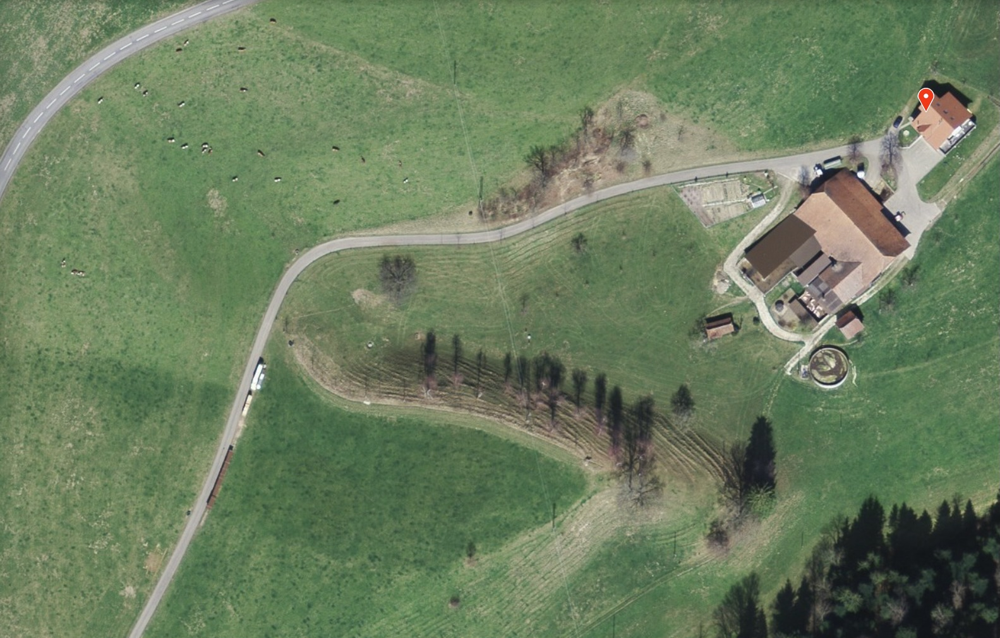
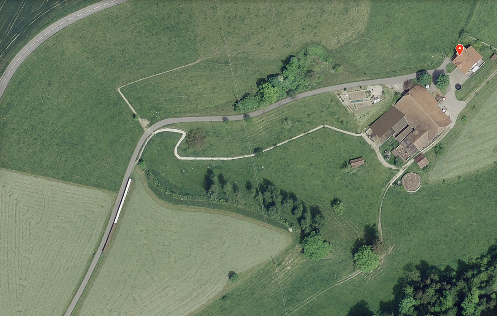

# Saubere Kühe = sauberes Gras

_Weideinfrastruktur / Bei den vielen Regentagen der letzten Weidesaison zeigte sich deutlich, ob die Weideinfrastruktur den betrieblichen Anforderungen genügten. Was gute Weidezugänge ausmacht und verschiedene spannende Ansätze von Betrieben in der ganzen Schweiz, erfährst du in diesem Beitrag. Mit Bildergallerie._

===

## 5 Gedanken zum Weideinfrastrukturen
1. Zahlreiche Faktoren haben Einfluss auf das Ausmass von Trittschäden. Eine Auswahl findet sich in der nachfolgenden Tabelle, sortiert nach absteigender Wichtigkeit. Das heisst, das Tierverhalten wird als grösserer Einfluss als das Tiergewicht angeschaut. Wobei die einzelnen Faktoren auch nicht strikte getrennt werden können, weil zum Beispiel ein unpassendes oder ungewohntes Grasangebot (zu jung, zu alt) auch das Tierverhalten beeinflussen kann (Unruhe vs. zufrieden fressen).

|  nicht veränderbar  |  beeinflussbar  |
|  :-----          |  :-----          |
|  Boden |  Tierverhalten |
|  Topographie  |  Grasnarbe |
|  Witterung |   Tiergewicht |

2. Bei Weideinfrastrukturen geht es nicht in erster Linie darum, **das Weideerlebnis für Tiere** und Mensch zu verbessern, und nur zweitranging um das Verhindern von Trittschäden mit baulichen (!) Massnahmen, die selber auch wieder die Futterfläche verkleinern. Massnahmen zur Reduktion von Trittschäden müssen darauf abzielen, die **unbewachsene Fläche** und die **Verschmutzung** der Klauen möglichst gering zu halten. Als Resultat lässt sich der Futterverlust minimieren, und der Boden kann seine Filterfunktion (Gewässerschutz) möglichst gut wahrnehmen. 

3. **Die geeigneten Infrastrukturen wie Auftriebswege, befestigte Eingangs- und Tränkebereiche sind abhängig vom Weidesystem und der Umsetzung auf dem Betrieb.**  DIE Lösung für alle gibt es nicht. Wenn kleinere Herden regelmässig eine Wiese queren müssen, reicht bei kleinen Herden ein kleines, klauenfreundlich gestaltetes Kuhweglein von 1m Breite. Der Betrieb mit automatischem Melksystem (AMS) und freiem Weidezugang braucht hingegen Kuhautobahnen, damit sich die Kühe individuell und ruhig zwischen Weide und Stall bewegen und kreuzen können. 
4. Wenn durchgetretene, morastige Stellen befestigt werden, kann es sein, dass sich die **Schäden örtlich verschieben** oder sogar **ausdehnen**. Das Management muss auch immer angeschaut werden: Wieso halten sich übermässig viele Tiere in einem bestimmten Bereich auf? Wieso bewegen sie sich mehr als nötig? 
5. Wenn die Tiere **nur zum Fressen auf die Weide** kommen, ist die Düngerverteilung besser und die Schäden reduzieren sich - vor allem bei nasser Witterung.

## Grundlagen aus der Literatur
In der Fotogallerie ganz unten werden zahlreiche Beispiele aus der Praxis gezeigt. Es gilt wie so oft in der Landwirtschaft: Generelle Empfehlungen sind schwierig, der Austausch mit den Kollegen vor Ort und etwas Experimentierfreude zahlen sich aus. Nachfolgend ein paar Ratschläge, welche im AGFF Infoblatt W14 [cite=agff-2004 /] (wo nicht anders angegeben) oder in anderer Literatur zu finden sind:

> Weidewege, worauf muss geachtet werden? [cite=agff-2004 /] 
* Ein befestigter Weg soll mehr als 20 Jahre halten!
* Lage des Weges gut planen: wie können möglichst viele Koppeln erschlossen werden?
* **Je grösser die Herde, desto breiter der Weg.** Die Herde kommt auf schmalen Wegen langsamer voran. Im Anfangsbereich ist eine Wegbreite von 3 bis 5 Metern erforderlich (Gedränge, Überholen, brünstige Tiere). Nach einer gewissen Distanz genügt eine Breite von 1 Meter, da sich die Herde in die Länge zieht; für Herden mit mehr als 50 Kühen bleibt jedoch eine Breite von 3 oder gar 4 Metern erforderlich.
* **Weiche Triebwege – die jedoch rasch abtrocknen** – sind grundsätzlich harten Bodenausführungen vorzuziehen. Diese schonen nicht nur die Klauen, sie werden auch von den Kühen bevorzugt aufgesucht. [cite=steinwidder-2008 /]
* Der Weg darf keine Steigung von mehr als 30% aufweisen; gegebenenfalls müssen Tritte gebaut oder der Weg verlängert werden.
* Wird der Weg ebenfalls von Fahrzeugen benutzt, muess er genügend breit und gut gebaut sein; ansonsten können sich Spuren bilden.
* Die Dauerhaftigkeit eines Weges hängt vom **Abfliessen des Wassers** ab: Bombierte Form, je nach Untergrund Drainage einbauen und tiefere Erdschichten vermeiden.
* Den Wegbau für das Legen von Wasser- und/oder Elektroleitungen nutzen.
* Der elektrische Zaun muss 50cm vom Wegrand entfernt sein; dies ergibt **gesamthaft eine minimale Wegbreite von 2 Metern**.

")

[ui-image-compare]

[/ui-image-compare]

Wenn ein Weg neu angelegt werden soll, muss neben der allfällig einzuholenden Baubewilligung, die fachlich korrekte Ausführug beachtet werden:

> Welche Arbeiten sind vor dem Legen des Belags zu erledigen? [cite=agff-2004 /] 
* Pflanzenschicht entfernen (15-20cm).
* In feuchten Zonen eventuell bei trockenem Wetter ein Acrylvlies (Stil "Bidim") auf den Untergrund legen.
* Mit dem herumliegenden Material auffüllen.
* Jede Schicht walzen udn zusammenpressen (besser zweimal als nur einmal).
* Das Abfliessen des Wassers sicherstellen, zum Beispiel durch eine Wölbung (Kies, Sand, Holzschnitzel) oder eine leichte Neigung von 2% (andere Beläge). 
* In niederschlagsreichen Regionen eine Drainage entlang des Weges vorsehen (Drainagerohre von 10-12 cm vor dem Auffüllen legen).
")

## Weitere Informationen

[Weideinfos von HBLFA Raumberg-Gumpenstein ](https://raumberg-gumpenstein.at/forschung/institute/bio-landwirtschaft-und-biodiversitaet-der-nutztiere/weideinfos?class=button)  
[ui-accordion independent=true open=none]
[ui-accordion-item title="Weideinfos bei HBLFA Raumberg-Gumpenstein (raumberg-gumpenstein.at)"]
[Hauptseite Weideinfos HBLFA Raumberg-Gumpenstein ](https://raumberg-gumpenstein.at/forschung/institute/bio-landwirtschaft-und-biodiversitaet-der-nutztiere/weideinfos?class=button)

[/ui-accordion-item]
[/ui-accordion]

[Weide-Triebwegbefestigungen im direkten Vergleich, HBLFA Raumberg-Gumpenstein (PDF) ](https://raumberg-gumpenstein.at/jdownloads/FODOK/2016/fodok_4_17653_weidetriebwege.pdf)
[plugin:youtube](https://www.youtube.com/watch?v=RgcuCzbcmwk)

[Teagasc Grass10 - Hauptseite Weideinfrastruktur (Englisch) ](https://www.teagasc.ie/crops/grassland/grass10/grazing-infrastructure/)
[Infrastruktur Handbuch für Rinderfarmen (PDF)](https://www.teagasc.ie/media/website/publications/2018/Beef-Farm-Infrastructure.pdf)

[AGFF Infoblatt W14 Zugangswege zu den Weiden: nützlich oder unnötig (AGFF, gedruckt)](https://www.agff.ch/online-shop/informationsblaetter.html) mit ausführlicher Bewertung der verschiedenen Materialien

