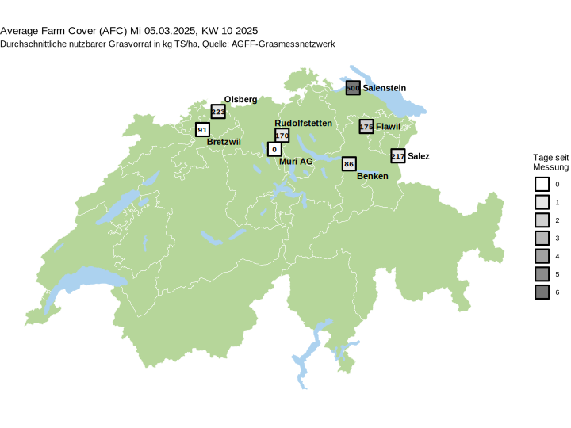

# Weidestart jetzt!

**Zahlreiche Vollweidebetriebe der Tal- und Hügelregion haben seit Mitte Februar mit dem Weidegang angefangen. Momentan verhindern frostige Nächte ein stärkeres, gut sichtbares Graswachstum.
**

[TOC]

===

Für das ganze Schweizer Mittelland heisst es seit anfangs März: Meist sonnig, Höchsttemperatur 12 bis 18 Grad. Ideale, trockene Bedingungen für den Weidestart. Je nach Grashöhe im Herbst und Überwinterung gibt es bereits einen Grasvorrat, der genutzt werden will. Alle für die Weide vorgesehenen Flächen kurz bestossen (anfangs nur stundenweise). Von Beginn an auf die angestrebte Weideabtriebshöhe abfressen lassen.

## Aktuelle Messwerte
Erste Betriebe schliessen bereits die zweite Messung der Grashöhe ab und können daher bereits die Zunahme der Biomasse ermitteln. Seit Mitte Februar ist demnach zwischen 5 bis 15 kg TS/ha/Tag gewachsen – gerade in dieser Zeit mit noch tiefem Sonnenstand und viel Schattenwurf variieren die Wachstumsbedingungen noch sehr stark von Ort zu Ort. 

Kühle bis frostige Nachttemperaturen bremsten in der vergangengen Woche das Graswachstum. Gemäss ersten Messungen waren Ende Februar Wachstumsraten von ca. 10 kg TS/ha/Tag möglich. Mit den erwarteten, milderen Nächten dürfte sich die Wachstumrate dieses Wochenende bereits gegen 20kg steigern.

Die teilnehmenden Betriebe melden durchschnittliche nutzbare Grasvorräte zwischen 100 und 300 kg TS/ha, wobei dieser Wert sehr stark von der festgelegten ("theoretischen") Stoppelhöhe abhängt und mit Vorsicht zu vergleichen ist. Auch werden die Grashöhen der einzelnen Parzellen momentan recht stark differieren, je nach Exposition und vorhandener Wärme. Wichtig ist auch zu wissen, dass bereits abgeweidete Koppeln in diesen Durchschnittswert einfliessen.

## Der frühe Weidebeginn macht Sinn

Wer seine Wiesen früh intensiv beweidet, profitiert von einigen **Vorteilen**:
- Der Futterberg während der Wachstumsspitze ist weniger ausgeprägt.
- Es wird früh eine gute Staffelung der Weidekoppeln erreicht.
- Vitamine und gute Gehalte vom jung gewachsenen Gras, die Bewegung und saubere Klauen sind gut für die Tiergesundheit und die Produktion.
- Effektive Unkrautbekämpfung durch noch unselektives Fressverhalten. 
- Früher und häufiger Verbiss fördert die Bestockung der Untergräser. Mehr Triebe = bessere Trittfestigkeit.

Gewisse Aspekte könnten als **Nachteil** ausgelegt werden:
- Weide muss bei Schnee oder viel Regen wieder pausiert werden.
- Bei mehrmaligen Wetterwechseln kann es mehrere Futterumstellungen für die Tiere bedeuten.

[AGFF Merbklatt 1 "Die Weide"](https://www.agff.ch/online-shop/merkblaetter.html?class=button&target="_blank" "Broschüre mit Grundlagen der erfolgreichen Weideführung bestellen")

## Pflegemassnahmen für Mähwiesen

Über die Weideflächen hinaus profitieren speziell Naturwiesen von einem sogenannten Pflegeweidegang im Frühjahr, weil er die Anteile der wertvollen Gräser fördert und die Verunkrautung hemmt.  Gemeines Rispengras und andere minderwertige Pflanzen werden gefressen und damit auch reguliert. Auf sehr intensiven Schnittwiesen, vor allem auch Ansaatwiesen in der Fruchtfolge, kann die Massnahme hingegen übers Jahr gesehen etwas Ertrag kosten. Aber auch dort nimmt man diesen Nachteil zu Gunsten einer dichteren Grasnarbe in Kauf, wenn im späteren Jahresverlauf auch geweidet werden soll.

Eine frühe Beweidung erspart oft weitere Massnahmen auf den betreffenden Parzellen. Welches Gerät wann am besten geeignet ist, wird im AGFF Infoblatt U5 gezeigt. Ein Walzen bei leicht feuchtem Boden kann allfällige Unebenheiten weiter reduzieren. Mäusehaufen werden am effizientesten mit einer Wiesenegge verstrichen - sinnvoll kombiniert mit einer Übersaat. Mechanische Pflegemassnahmen sind speziell auf den Parzellen angebracht, auf denen als nächstes eine Schnittnutzung folgen wird. 

[Übersicht Pflegemassnahmen (eAGFF.ch)
](https://www.eagff.ch/problempflanzen-schaedlinge-krankheiten/unkrautregulierung-1/indirekte-massnahmen/pflegemassnahmen?class=button&target="_blank") [AGFF Infoblatt U5 Wiesen- und Weidepflege](https://www.eagff.ch/files/images/bilder/Unkraut_Schaderreger/PDFs/AGFF_U5_Streigeln_usw_d_HSz1.pdf?class=button&target="_blank" "PDF ansehen / herunterladen") 

## Bildergallerie

