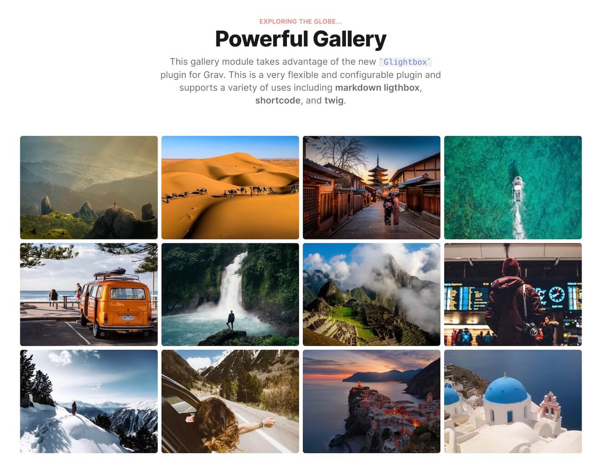

# Lightbox Gallery Plugin

The **Lightbox Gallery** Plugin is an extension for [Grav CMS](http://github.com/getgrav/grav) providing A lightweight but flexible lightbox implementation based on the fantastic [GLightbox Library](https://biati-digital.github.io/glightbox). This plugin provides custom grav shortcodes as well as Twig partial that can be used directly or in a gallery template. An example of a gallery can be seen in the Typhoon Grav theme with the `modular/gallery.html.twig` template.



### Features

- **Small** - only 11KB Gzipped
- **Shortcode Support** - Supports [lightbox-gallery] and [lightbox] shortcodes
- **Editor Pro Support** - NEW shortcode integration with Editor-Pro WYSIWYG editor (requires Editor-pro v1.1.0+)
- **Framework Agnostic** - No jQuery or other JavaScript framework required.
- **Fast and Responsive** - works with any screen size
- **Gallery Support** - Create multiple galleries
- **Video Support** - Youtube, Vimeo and self hosted videos with autoplay
- **Inline content support** - display any inline content
- **Iframe support** - need to embed an iframe? no problem
- **Keyboard Navigation** - esc, arrows keys, tab and enter is all you need
- **Touch Navigation** - mobile touch events
- **Zoomable images** - zoom and drag images on mobile and desktop
- **API** - control the lightbox with the provided methods
- **Themeable** - create your skin or modify the animations with some minor css changes

## Usage

### Gallery Lightbox Shortcode

The preferred way to create a gallery is using the `[lightbox-gallery]` wrapper shortcode. This simplifies syntax, handles grouping automatically, allows sharing thumbnail options, and supports inline descriptions naturally.

You can pass `thumb_options` to the wrapper to automatically resize thumbnails for all images in the gallery.

```markdown
[lightbox-gallery thumb_options="cropZoom=200,200" class="grid grid-cols-4 gap-4"]
    [lightbox image="red-dbs-1.jpg"]
        ### Aston Martin DBS 1
        Morbi ac interdum velit. Ut sed purus in **erat feugiat mollis**. In porta ligula quis vulputate ullamcorper.
    [/lightbox]

    [lightbox image="red-dbs-2.jpg"]
        ### Aston Martin DBS 2
        Aenean eu condimentum odio. Aliquam ac justo eget libero ullamcorper vehicula.
    [/lightbox]

    [lightbox image="red-dbs-3.jpg" thumb="red-dbs-3.jpg?cropZoom=300,300]
        ### Aston Martin DBS 3
        You can easily add rich descriptions to each item.
    [/lightbox]
[/lightbox-gallery]
```

### Basic Lightbox Shortcode

You can also use the standalone `[lightbox]` shortcode for individual images or more custom layouts.

```markdown
[lightbox image="white-vantage-v12.jpg" zoomable="false" draggable="false"]

[/lightbox]
```

Supported attributes:
* `image` → target image
* `video` → target video (YouTube, Vimeo, or local path)
* `thumb` → custom thumbnail with media processing support
* `class` → classes applied to the lightbox link
* `gallery` → gallery name (for grouping)
* `title` → title of the image
* `desc` → textual description or class reference
* `descPosition` → position of description (top, bottom, left, right)
* `width`, `height` → dimensions
* `zoomable`, `draggable` → boolean flags

## Important Links

* [Lightbox Gallery Documentation](https://getgrav.org/premium/lightbox-gallery/docs)
* [Lightbox Gallery Details](https://getgrav.org/premium/lightbox-gallery)

## Credits

* [Bati Digital for their amazing Lightbox Gallery script](https://biati-digital.github.io/glightbox)