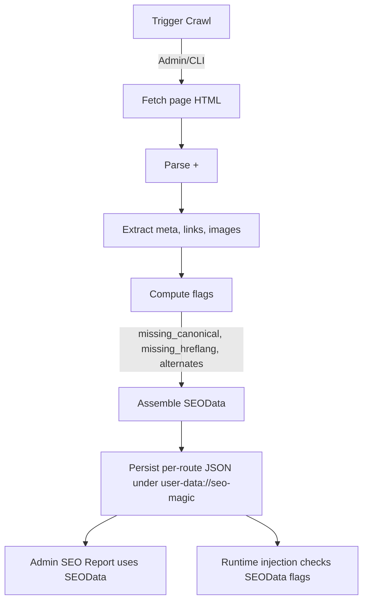
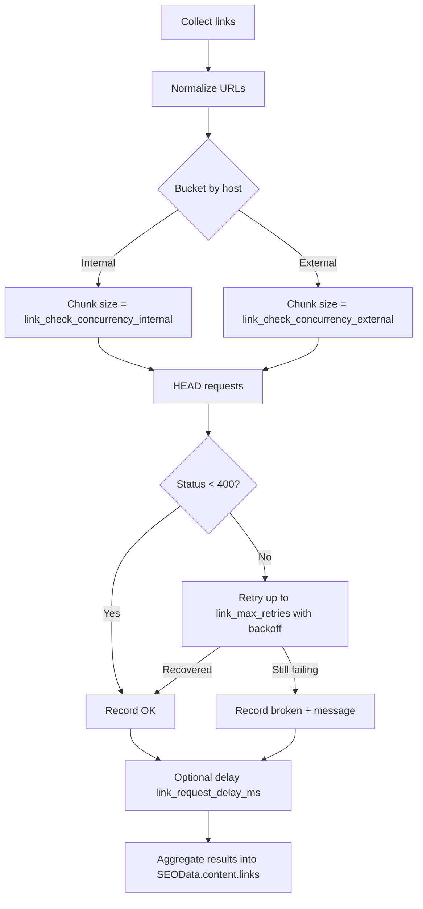

# SEO Magic Plugin

The **SEO Magic** Plugin is for [Grav CMS](http://github.com/getgrav/grav). A **valid SEO Magic License** is required to install and use this plugin.  Please check out the [SEO Magic Premium page](https://getgrav.org/premium/seo-magic) for full details.

## Installation

Installing the Seo Magic plugin can be done in one of two ways. The GPM (Grav Package Manager) installation method enables you to quickly and easily install the plugin with a simple terminal command, while the manual method enables you to do so via a zip file.

### GPM Installation (Preferred)

The simplest way to install this plugin is via the [Grav Package Manager (GPM)](http://learn.getgrav.org/advanced/grav-gpm) through your system's terminal (also called the command line).  From the root of your Grav install type:

    bin/gpm install seo-magic

This will install the Seo Magic plugin into your `/user/plugins` directory within Grav. Its files can be found under `/your/site/grav/user/plugins/seo-magic`.

### Manual Installation

To install this plugin, just download the zip version of this repository and unzip it under `/your/site/grav/user/plugins`. Then, rename the folder to `seo-magic`. You can find these files on [GitHub](https://github.com/trilbymedia/grav-plugin-seo-magic) or via [GetGrav.org](http://getgrav.org/downloads/plugins#extras).

You should now have all the plugin files under

    /your/site/grav/user/plugins/seo-magic
	
> NOTE: This plugin is a modular component for Grav which requires [Grav](http://github.com/getgrav/grav) and the [Error](https://github.com/getgrav/grav-plugin-error) and [Problems](https://github.com/getgrav/grav-plugin-problems) to operate.

### Admin Plugin

If you use the admin plugin, you can install directly through the admin plugin by browsing the `Plugins` tab and clicking on the `Add` button.

## Usage

Full information can be found in the [SEO Magic Documentation](https://getgrav.org/premium/seo-magic/docs)


## What's New in 6.0 (SEO‑Magic 2.0)

This is a concise, changelog‑style summary of the major changes.

New
- Admin Dashboard at `/admin/seo-magic` with modern summary cards (Pages, Avg Score, Pages with Issues, Broken Links, Broken Images, Trend) and a filterable, paginated table.
- Re‑crawl split button: primary action runs full crawl; dropdown offers “Re‑crawl (changed)”.
- Live progress for crawls (full/changed): progress bar, last processed page, Cancel button; content auto‑refreshes via partial HTML swap.
- Admin tasks powering the UI: `taskProcessSEOMagic` (supports `mode=full|changed`), `taskSEOMagicStatus`, `taskSEOMagicCancel`, `taskSEOMagicPartial` (HTML fragment).

Improved
- Metrics clarified: replaced ambiguous “Pages w/ Broken” with “Pages with Issues”, plus separate counters for “Broken Links” and “Broken Images”.
- Robustness: works under php‑fpm and mod_php by unlocking the PHP session during long runs; partial swaps use HTMX when available or a bundled `htmx-lite.js` fallback.
- Security & defaults: TLS verification enabled by default; canonical link injected if missing; crawler falls back to enumerating routable pages when sitemap JSON is unavailable.
- Social metadata: adds `og:image:alt`, `og:locale`; de‑emphasizes `<meta name="keywords">` via `write_keywords_meta` toggle.
- Link checker: safer batching (internal vs external), retries with backoff; optional Scheduler jobs for periodic scans.

Changed
- Scoring model v2: keywords removed from score; new checks for canonical, hreflang, JSON‑LD, and OG image quality.

Fixed
- Admin route 404: added admin page stub so `/admin/seo-magic` always resolves.

#### Theme Integration for JSON‑LD

Option 1 — Use the partial in your theme layout (e.g. in `<head>`):

```

```

Option 2 — Use the function to customize output:

```


  <script type="application/ld+json">{{ s|json_encode(constant('JSON_UNESCAPED_SLASHES') bitor constant('JSON_UNESCAPED_UNICODE')) }}</script>

```

If you prefer manual control, set `plugins.seo-magic.structured_data.auto_inject: false`.

- Canonical/Hreflang Injection Controls
  - New injection toggles under `plugins.seo-magic.inject`:
    - `canonical_always` (default true) and `canonical_if_missing` (default true)
    - `hreflang_always` (default true) and `hreflang_if_missing` (default true)
  - When “always” is enabled, tags are injected on every request. If disabled, the “if_missing” behavior uses crawl flags (`head.flags.missing_canonical`, `head.flags.missing_hreflang`) to decide.

- Tests
  - Unit tests added for scoring, metadata extraction, and URL utilities. Run Codeception units from the project root: `composer test`.

See the [CHANGELOG](CHANGELOG.md) for details.

### Injection Decision Flow

```mermaid
flowchart TD
  A[Request page] --> B{Inject Canonical?}
  B -->|canonical_always = true| C[Add <link rel="canonical" href=page.url(true)>]
  B -->|canonical_always = false| D{canonical_if_missing = true AND flag missing?}
  D -->|Yes| C
  D -->|No| E[No canonical injected]

  A --> F{Inject Hreflang?}
  F -->|languages disabled| G[Skip]
  F -->|languages enabled| H{hreflang_always = true}
  H -->|Yes| I[Build alternates from translatedLanguages() + x-default]
  H -->|No| J{hreflang_if_missing = true AND flag missing?}
  J -->|Yes| I
  J -->|No| K[No hreflang injected]
```

Notes
- Crawl flags are persisted per page under `head.flags.*` and updated by the crawler.
- When “always” is enabled, flags are ignored and tags are injected on every request.
- Hreflang alternates include `x-default` pointing to the default language URL.

### Crawl Data Lifecycle



Details
- Flags set during crawl: `head.flags.missing_canonical`, `head.flags.missing_hreflang`, and `head.alternates`.
- SEOData JSON path is stable by route, used by Admin UI and runtime logic.
- When a page is new (no crawl yet), Admin uses sensible fallbacks for preview.

### Link Checker Batching Lifecycle



Notes
- Concurrency, retries, timeouts, and delays are configurable in `seo-magic.yaml`.
- Internal links are processed conservatively; external links allow higher concurrency.
- Results feed into both Admin reports and the crawler’s stored data.
- Internal link collection respects `robots.txt` Disallow rules for `User-agent: *` and optional `link_ignore_patterns`.

### Robots & Ignore Rules

- The crawler/link checker reads `robots.txt` and ignores internal links matching any `Disallow` path (for `User-agent: *`).
- You can also configure `plugins.seo-magic.link_ignore_patterns` (regex or substring) to skip specific links.
- Control behavior via:
  - `plugins.seo-magic.link_respect_robots` (default true)
  - `plugins.seo-magic.link_robots_user_agent` (default `*`; matched group is preferred, falls back to `*`).

### Scheduler

If you use Grav’s Scheduler, you can enable periodic jobs by adding in `user/config/plugins/seo-magic.yaml`:

```
scheduler:
  process_cron: '0 2 * * *'      # nightly crawl
  link_cron: '0 3 * * *'         # nightly link check
```

Logs are written to `log://seo-magic-process.log` and `log://seo-magic-link-checker.log`.

### Exports

- Admin → Tools → Reports → SEO‑Magic Report provides Export JSON and Export CSV buttons.
- CSV includes columns: `route, rawroute, title, url, score, total_links, broken_links_count, first_broken_link, broken_links`.
- Use the “Show only pages with broken links” checkbox to focus the report.


## Configuration Reference

### Injection

| Key | Default | Description |
| --- | --- | --- |
| `plugins.seo-magic.inject.canonical_always` | `true` | Always inject canonical link using `page.url(true)` |
| `plugins.seo-magic.inject.canonical_if_missing` | `true` | Inject canonical when the last crawl flagged it missing |
| `plugins.seo-magic.inject.hreflang_always` | `true` | Always inject hreflang alternates for all translations |
| `plugins.seo-magic.inject.hreflang_if_missing` | `true` | Inject hreflang when last crawl flagged it missing and translations exist |

### Crawler

| Key | Default | Description |
| --- | --- | --- |
| `plugins.seo-magic.client_timeout` | `30` | HTTP client timeout (seconds) |
| `plugins.seo-magic.client_connections` | `6` | Max HTTP connections used by crawler |
| `plugins.seo-magic.page_crawl_delay_ms` | `100` | Delay between crawled pages (milliseconds) |
| `plugins.seo-magic.page_retry_attempts` | `2` | Page request retry attempts |
| `plugins.seo-magic.page_retry_backoff_ms` | `250` | Backoff between page retries (milliseconds) |
| `plugins.seo-magic.insecure_tls` | `false` | Opt‑out TLS verification (only for edge cases) |
| `plugins.seo-magic.body_selectors` | see YAML | CSS selectors to isolate content used for summary/keywords |
| `plugins.seo-magic.ignore_routes` | `[]` | Routes to skip during crawl |
| `plugins.seo-magic.enable_quicktray` | `true` | Adds a QuickTray button that redirects to the Dashboard and starts a crawl |

### Link Checker

| Key | Default | Description |
| --- | --- | --- |
| `plugins.seo-magic.enable_link_checker` | `false/true` | Enable link verification in crawl (can be heavy) |
| `plugins.seo-magic.link_check_timeout` | `10` | Per‑link HEAD timeout (seconds) |
| `plugins.seo-magic.link_max_retries` | `2` | Retries for failing links |
| `plugins.seo-magic.link_retry_backoff_ms` | `200` | Backoff between retries (milliseconds) |
| `plugins.seo-magic.link_check_concurrency_internal` | `1` | Internal link concurrency per batch |
| `plugins.seo-magic.link_check_concurrency_external` | `4` | External link concurrency per batch |
| `plugins.seo-magic.link_request_delay_ms` | `0` | Inter‑batch delay (milliseconds) |
| `plugins.seo-magic.link_check_whitelist` | `[]` | Hostnames to always allow |
| `plugins.seo-magic.enable_image_checker` | `true` | Check `` status codes |
| `plugins.seo-magic.image_check_sequential` | `true` | Use sequential image checks (lower load) |

### Admin Tasks (API)

| Task | Purpose |
| --- | --- |
| `taskProcessSEOMagic` | Starts a crawl. Accepts `mode=full|changed` |
| `taskSEOMagicStatus` | Returns JSON progress: `running, mode, total, processed, last, state` |
| `taskSEOMagicCancel` | Signals the current job to stop early |
| `taskSEOMagicPartial` | Returns the dashboard HTML fragment for partial refresh |

Notes
- All admin tasks require `admin.pages` or `admin.super` and a valid `admin-nonce`.
- Partial refresh uses HTMX if present; otherwise the plugin’s `htmx-lite.js` fallback performs the swap.
