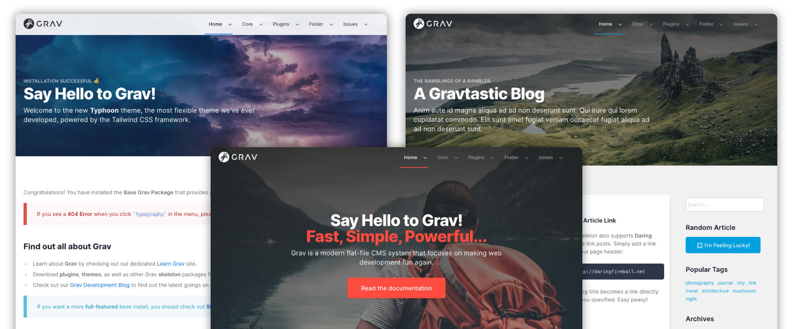

# Typhoon Theme

**Typhoon** for [Grav CMS](http://github.com/getgrav/grav) is a highly flexible theme that is built on top of the modern [Tailwind CSS](https://tailwindcss.com/) framework.  The theme provides a flexible architecture for building beautiful sites and serves as a great base for custom theme designs.  It makes use of the powerful theme variable system available in Grav to set global defaults and then override those at a page level.  

## Features

* Built on top of the latest TailwindCSS 4.0 framework
* Utilized Tailwind CLI to create high performance and optimized 'production' CSS files
* Fully responsive and built "mobile-first"
* Supports both "Light" & "Dark" themes
* Can use system settings, a specific variation, or user controlled light/dar theme preference
* User configurable 'primary' and 'default text' colors
* Flexible dropdown menu and side navigation support
* Responsive mobile menu with support for multiple levels of navigation
* Customizable logo including dynamic SVG logo support
* Configurable menu bar (auto, dark, light, transparent)
* Powerful Hero configuration for any page not just modular pages
* Fully configurable footer
* Clean default typography
* Blog Site example
* One-Page modular example with GLightbox gallery support + Contact form

## Typhoon 4.0 w/TailwindCSS 4.0 Upgrade Notes

Typhoon 4.0 has been completely overhauled for TailwindCSS 4.0 due to the fundamental architectural changes made in the framework.  As such after upgrading form Typhoon 2.x to Typhoon 4+, you will have some extra files that are no longer needed and can be removed.  

**Manually remove these files:**

* `/postcss.config.js` (moved to vite for Tailwind build)
* `/tailwind.config.js` (moved to `/css/site.css` for Tailwind4 css-variable based config)
* `/tailwind-full.config.js` (unused)
* `/css/custom/bugs.css` (no longer needed as safari doesn't need this fix any longer)
* `/css/custom/dark.css` (moved dark styling into `/css/custom/typography.css`)
* `/css/custom/social.css` (changed to css-variables and moved remaining to `/css/custom/typography.css`)
* `/js/alpine.js` (replaced with latest `/js/alpine.js.min`)

## Important Links

* [Typhoon Documentation](https://getgrav.org/premium/typhoon/docs)
* [Typhoon Details](https://getgrav.org/premium/typhoon)